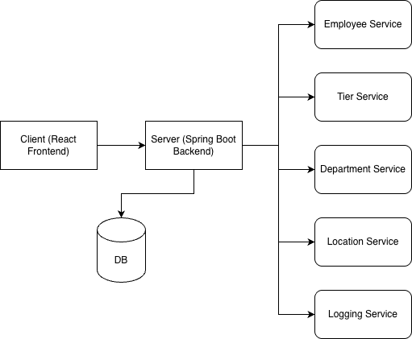
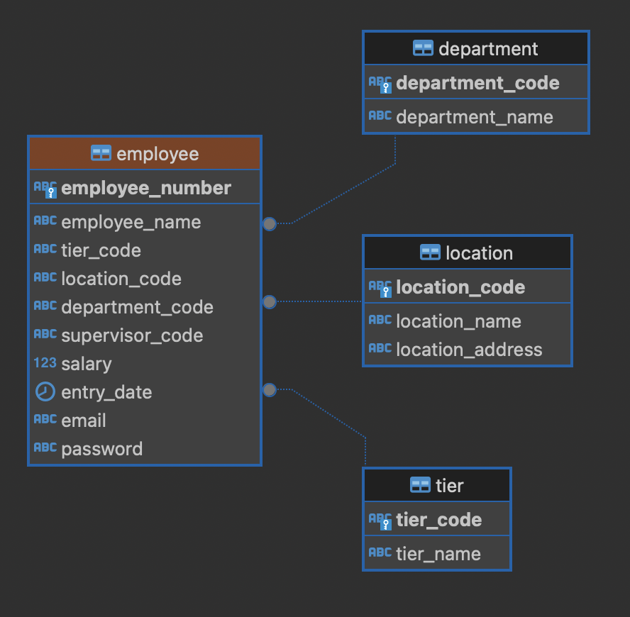

# OpsNow Test - Full Stack (Spring Boot + React + PostgreSQL)

This repository contains a Spring Boot backend, a React frontend, and a PostgreSQL database wired together with Docker Compose.

## Prerequisites

- Docker and Docker Compose installed

## Quick Start

```bash
docker compose up --build
```

- Frontend: `http://localhost:3000`
- Backend API: `http://localhost:8080/api`
- PostgreSQL: `localhost:5432` (db: `postgres`, user: `admin`, password: `password`)

To stop and remove containers:

```bash
docker compose down
```

To run the code locally

```bash
cd opsnow-fronted & npm install
npm start

cd opsnow-be & mvn clean install
mvn spring-boot:run
```

## Login Credentials
For simplicity purpose i've added two new columns (email & password) as the login credentials.
The default password is **password123**.

## Services (docker-compose)

- **db**: PostgreSQL
  - Env: `POSTGRES_DB=postgres`, `POSTGRES_USER=admin`, `POSTGRES_PASSWORD=password`
  - Port: `5432:5432`
- **backend**: Spring Boot
  - Builds from `opsnow-be/Dockerfile`
  - Ports: `8080:8080`
  - Env:
    - `SPRING_DATASOURCE_URL=jdbc:postgresql://db:5432/opsnow`
    - `SPRING_DATASOURCE_USERNAME=admin`
    - `SPRING_DATASOURCE_PASSWORD=password`
- **frontend**: React
  - Builds from `opsnow-frontend/Dockerfile`
  - Port: `3000:80`
  - Build arg: `REACT_APP_API_URL` (defaults to `http://localhost:8080/api` in `docker-compose.yml`)

### Changing the frontend API base URL

Update the build arg in `docker-compose.yml` under the `frontend` service:

```yaml
args:
  REACT_APP_API_URL: http://localhost:8080/api
```

## CORS

The backend currently allows the origins `http://localhost:3000` and `http://localhost:3001` in `opsnow-be/src/main/java/com/ram/opsnow/config/CorsConfig.java`. If you change the served host/port, update allowed origins accordingly.

## Architecture Diagram (Mermaid)



## ERD



## Project Structure

- `opsnow-be/`: Spring Boot app (Java 21, Spring Boot 3)
- `opsnow-frontend/`: React app
- `docker-compose.yml`
- `docs/erd.png`: ERD image
